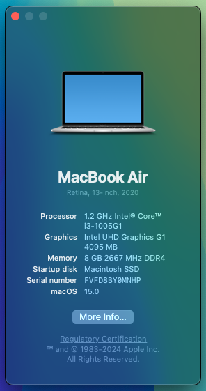

# OpenCore Hackintosh EFI for Lenovo IdeaPad 3 15IIL05
*Based on the OpenCore bootloader; off of the [OpenCorePkg](https://github.com/acidanthera/OpenCorePkg) made by [acidanthera](https://github.com/acidanthera) hosted on GitHub. Followed the [Dortania's OpenCore Install Guide](https://www.google.com/url?sa=t&rct=j&q=&esrc=s&source=web&cd=&cad=rja&uact=8&ved=2ahUKEwjH3Oa9zM-GAxWT4ckDHUk3AMwQFnoECBIQAQ&url=https%3A%2F%2Fdortania.github.io%2FOpenCore-Install-Guide%2F&usg=AOvVaw0-C3oq3BIYKrFYg3XoR6SD&opi=89978449) to get everything working from scratch for best stability and compatibility!*

**WARNING/DISCLAIMER (VERY IMPORTANT)**: This EFI only supports running macOS Big Sur (11) to macOS Sonoma (14)! 

# Prequisites
In order for Wi-Fi to work on macOS Sonoma (14), you MUST download & install an application named HeliPort.dmg from the [HeliPort](github.com/OpenIntelWireless/HeliPort/releases/latest) GitHub repository! 

## Specifications/Specs

| | |
|-|-|
|**CPU**|Intel® Core™ i3-1005G1 Processor @ 1.2GHz (Ice Lake)|
|**RAM**|8GB DDR4 2667MHz|
|**iGPU**|Intel® UHD Graphics G1|
|**SSD**|NVMe M.2 SKHynix-HFM512GDHTNI-87A0B 512GB|
|**WLAN+BT**|Intel® Wireless-AC 9560 (A BCM card natively supported by macs will work not by much but more stable)|
|**Audio**|Realtek ALC230|
|**Ports**|2xUSB3.0, 1xUSB2.0, HDMI (does not work at all on Ice Lake devices), SD card reader, Headphone Jack, and DC charging port|
|**OpenCore Bootloader**|V1.0.1 MOD (Will constantly be updated, including the kexts/drivers, so all you have to do is come back after a month or so and look for a commit along the lines of "Updated OpenCore to X.X.X MOD!"!)

## Not Working

- HDMI (which will probably never be fixed. BTW, this issue is exclusive to only Ice Lake.)
- Hibernation (won't cause a problem though, as I disabled it in OpenCore)
- You tell me?!

## Working

- **Everything else that is not in the Not Working section :D**
- Bluetooth (works natively on all macOS)
- WLAN (works natively on all macOS except Sonoma; read [this section](#prequisites) for easy instructions on how to fix for macOS Sonoma (14).
- USB ports mapped precisely (working after sleep)
- ELAN Precision HID Touchpad with fully working gestures
- Audio (and the keys for it), with speaker, microphone, and headphone jack support
- Graphics Acceleration (QI/CI)
- Sleep
- SDHC/SDXC card reader
- Brightness (and the keys for it)

## Conclusion

In conclusion, I hope there are no issues to your very own hackintosh quest. If there are issues; pull requests or suggestions are welcome! :). Here is the [official forum](https://www.olarila.com/topic/37423-perfect-vanilla-efi-for-lenovo-ideapad-3-15iil05-only-for-macos-big-sur-to-sonoma-trijintosh/) where my EFI was always hosted for another contact source!
